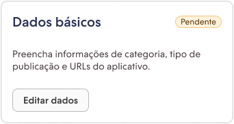
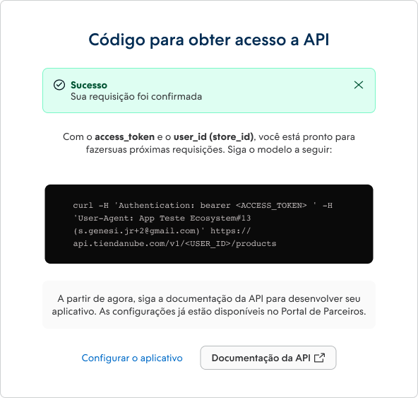

import { Alert } from '@nimbus-ds/components';

# Autenticação

Este guia apresenta métodos de autenticação de aplicativos com a plataforma Nuvemshop. Descubra como garantir segurança e acesso autorizado para integrações perfeitas entre seus aplicativos e nossa plataforma.

## Autenticação da API

A autenticação e autorização de usuário são fornecidas por meio de uma implementação restrita do OAuth 2. Atualmente, oferecemos suporte apenas ao fluxo ["Código de Autorização"](https://oauth.net/2/grant-types/authorization-code/) para a concessão de acesso. Ao seguir este fluxo, você obtém [tokens de acesso](https://oauth.net/2/access-tokens/) que não expiram, permanecendo válidos até que sejam renovados.

## Tokens de Acesso e Identificação

Os tokens de acesso que fornecemos não possuem data de expiração. Eles se tornam inválidos somente quando um novo token é obtido ou quando o usuário desinstala o aplicativo. Junto com o token de acesso, também é fornecido um `user_id`, que corresponde ao ID da loja. Este `user_id` é essencial para realizar solicitações à nossa API e também pode ser usado para autenticar usuários do aplicativo em seu site.

A autenticação é um passo fundamental para acessar nossos serviços via API. Certifique-se de incluir o `user_id` nas suas solicitações para garantir autenticação e autorização adequadas.

## Tipos de Métodos de Autenticação

A escolha do método de autenticação depende do tipo de aplicativo que você está desenvolvendo:

- Se você está criando aplicativos standalone, com ou sem nosso template, é necessário utilizar OAuth 2.
- Para aplicativos nativos que se integram ao admin da Nuvemshop usando o Nexo, são utilizados tokens de acesso gerados no admin da Nuvemshop.

Nossos modelos de criação de aplicativos já incluem um sistema de autenticação integrado à nossa API. Isso reduz significativamente o tempo de desenvolvimento para nossos parceiros que optam por utilizar esses templates. No entanto, caso o parceiro escolha não usar um dos nossos modelos, é possível realizar a autenticação manualmente. A seguir, apresentaremos como isso pode ser feito de maneira eficaz.

## Obtendo o token de acesso

<Alert appearance="warning" title="Atenção">
    Ao concluir o processo de obtenção, você receberá um código cURL, essencial para gerar o access_token. É importante ressaltar que esse código possui uma validade de apenas 5 minutos. Certifique-se de utilizá-lo dentro desse período para garantir um acesso bem-sucedido.
</Alert>

<br />

### Alterando a URL de redirecionamento

Se você tiver modificado a URL de redirecionamento, por favor, substitua-a e salve a nova URL em `https://partners.nuvemshop.com.br/applications/authentication/:app-id` para acessar a página com o código cURL. O campo de URL de redirecionamento pode ser encontrado no formulário de **Dados Básicos**.



Esta etapa é crucial para garantir que o redirecionamento funcione corretamente e que você possa acessar a página de código cURL sem problemas. Certifique-se de atualizar a URL de redirecionamento conforme necessário.

### Fazendo a Requisição com o Código cURL

Após concluir a instalação, você será redirecionado para uma nova página contendo o código cURL necessário para gerar o seu `access_token`. Basta copiar esse código e realizar a requisição utilizando a ferramenta de sua preferência.


A estrutura do cURL gerado consiste em:

- **client_id**: O App ID de seu aplicativo;
- **client_secret**: Seu client secret;
- **code**: O código obtido na URL após a instalação do aplicativo na loja de demo.

Essa etapa é fundamental para obter com sucesso o access_token e garantir o acesso autorizado à nossa plataforma.

Se a requisição for bem-sucedida, você receberá uma resposta no formato semelhante a este exemplo:



```javascript
{
    "access_token": "88a2fdd17e10327ed96f4f2dc96b00bca60dfe60",
    "token_type": "bearer",
    "scope": "write_products",
    "user_id": 2093261
}
```

Você pode montar o comando cURL manualmente com base no exemplo fornecido. Aqui está o comando cURL para realizar a requisição POST utilizando as informações mencionadas:

```bash
curl -X POST "https://www.tiendanube.com/apps/authorize/token" \
-d "client_id=client_id" \
-d "client_secret=client_secret" \
-d "code=code"
```

Certifique-se de substituir `client_id`, `client_secret` e `code` pelos valores corretos do seu aplicativo criado no Portal de parceiros.
Lembrando que você pode executar esse comando em um terminal ou em uma ferramenta que suporte cURL para testar a requisição e obter o access_token.

### Como obter um novo código cURL

Para isso siga estes passos:

1. Ao receber o alerta informando que a requisição não foi confirmada, clique no botão **Tente outra vez**.
2. Você será redirecionado para a sessão **Meus aplicativos** no administrador da sua Loja de demo.
3. No administrador da sua loja demo, na sessão **Meus aplicativos**, verifique se o aplicativo está instalado. Caso esteja faça a [desinstalação](./overview.md#desinstalando-um-aplicativo).

Caso a requisição tenha falhado devido à expiração do código cURL ou algum erro, você pode obter um novo código [desinstalando](./overview#desinstalando-um-aplicativo) e [reinstalando](./overview.md#instalando-seu-aplicativo) o seu aplicativo na loja novamente.


Seguindo essas etapas, você poderá obter um novo código cURL válido e retomar o processo de [autenticação](./authentication#obtendo-o-token-de-acesso) com sucesso. Certifique-se de acompanhar as instruções com atenção para evitar problemas futuros.

---

## Próximos passos

- Saiba mais sobre [Aplicativos](./overview.md)
